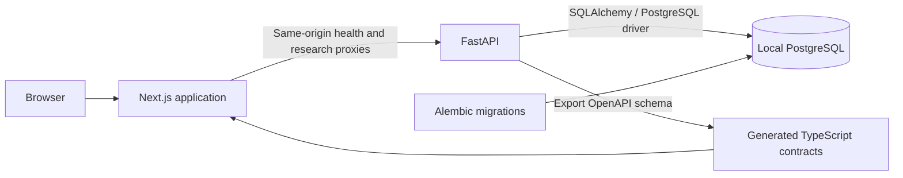

# Application architecture through Milestone 2C and provider contracts

## Request path

`apps/web` contains the Next.js App Router application and shadcn/ui components.
`/portfolio`, `/universe` and `/company/[id]` display persisted API state with
loading, empty, missing and retry states. The Company Explorer composes identity,
portfolio context, scores, ranking snapshots, market facts and normalized model
outputs without moving calculations into React. `/api/health` proxies readiness;
`/api/research/[...path]` allows only the implemented UI reads and explicit lifecycle,
score, ranking, listing-specific market-data, model-output and portable model-contract
operations. Both proxies validate runtime responses and sanitize upstream failures.
The browser uses the web origin; backend connection settings remain server-side.

`apps/api` contains FastAPI, Pydantic configuration/contracts, SQLAlchemy database access, and Alembic migrations. The health request verifies database access. Application startup does not silently create schemas, run imports, or initialize financial data; schema changes are explicit Alembic commands.

`packages/contracts` contains the exported OpenAPI schema and generated TypeScript definitions consumed by the frontend. Pydantic/API contracts are authoritative. Regenerate the checked-in artifacts after changing API schemas; do not hand-maintain a second copy of the response interface in React.

## Configuration

Local PostgreSQL is the initial development database. The API's database URL is supplied through environment variables and is also used by Alembic. No application/domain code assumes whether PostgreSQL runs as a local service, in a future Docker Compose service, or at another host.

The example environment documents non-production development settings. Actual credentials belong in ignored local environment files or the process environment. Never expose the database URL through a `NEXT_PUBLIC_` setting or send it to the browser. Server configuration and database failures must not return credentials or SQL connection strings in HTTP responses.

Follow the root [README](../README.md) for the verified dependency installation, database preparation, migrations, checks, and startup sequence. Milestone 0 does not require Docker.

## External data

Future provider-backed sources enter through raw provider records and deterministic,
domain-specific normalizers before becoming canonical observations. The shared
Python contracts are in `portfolio_api.external_data`; the policy for source
precedence, temporal queries, corrections and raw retention is in the
[external-data architecture](external-data-architecture.md). The current workbook
importers remain explicit migration adapters and no provider SDK or runtime feed
has been added.

## Boundaries and scope

The frontend owns navigation, presentation, interaction, and user feedback. Backend modules will own all investment calculations, ranking/scoring algorithms, portfolio analytics, and execution derivation. PostgreSQL will own migrated canonical state and immutable history. The same definitions must not be recreated in frontend components.

Baseline `0001` contains no domain tables. Later revisions add identity, portfolio,
score, ranking, market, model, and external-data domains. The original fictional
score/ranking seed remains demonstration data; the current rank definitions are
verified separately against documented workbook formulas and canonical inputs.
Health status establishes infrastructure readiness, not investment-data freshness.

The initial stack stays small: interactive table/chart dependencies, authentication,
market-data providers, queues, research agents and model engines are deferred until
their scoped milestones require them. See [domain-model.md](domain-model.md) for
implemented decisions and future design, and [migration.md](migration.md) for
acceptance requirements.

## Domain operations and integrity

`domain/models.py` owns relational structure, `schemas.py` owns Pydantic contracts,
`services.py` owns explicit writes, and `queries.py` composes read views. REST writes
commit or roll back atomically before returning. Decimal quantities and weights
serialize as exact fixed-notation strings, including observed zero and tiny fractions.

Lifecycle transitions lock the company and compare `expected_event_id` (null for
initial assignment), append an event and update its separate current-state pointer.
Stale decisions return 409. Backdated lifecycle decisions are rejected in this slice.
Holdings and targets never alter lifecycle. The API serializes portfolio creation
to enforce one logical portfolio while retaining an extensible table.

Holding snapshots distinguish COMPLETE, PARTIAL and UNAVAILABLE, use latest
effective time for current reads, and retain listing-specific quantities and separate
native-currency cash. Target drafts validate fractions and totals; explicit acceptance
locks and revalidates persisted rows. Accepted targets remain immutable, with residual
strategic cash calculated in the API. Missing rows differ from authored zero targets.

ORM guards prevent changes/deletion of history and accepted target rows. Foreign
keys use RESTRICT for historical references. There are no destructive REST endpoints.
These application guards do not prevent administrator SQL or SQLAlchemy bulk SQL
from bypassing service rules; database administration is outside the domain API.
No triggers or generic event-sourcing framework are introduced. Actors are explicit
LOCAL_USER, SYSTEM or IMPORT attribution, without authentication.

Score definitions and assessments are explicit to the four canonical dimensions.
Definitions preserve scale/direction/methodology versions; assessment corrections
append a record and can link to the superseded observation. Rankings use separate
versioned definitions for Portfolio, Watchlist, and Research, then immutable runs and
one explicit status row per company in the observed universe. Positive integer
positions are allowed only for a ranked result; missing inputs keep position null.
All three ranks calculate their documented methodologies from separate canonical
inputs and store their input/source context on immutable runs. Run history is read as
stored and is never regenerated from current lifecycle or data.

## REST operations

All domain endpoints have the `/v1` prefix. Swagger at `/docs` exposes exact request
and response schemas. Unknown records return 404, conflicts 409, invalid contracts
422, and database failures a sanitized 503.

| Method     | Path                                                                  | Operation                                                                                 |
| ---------- | --------------------------------------------------------------------- | ----------------------------------------------------------------------------------------- |
| GET        | `/universe?lifecycle=...&search=...`                                  | Query companies and current lifecycle; literal name/ticker search                         |
| POST       | `/companies`                                                          | Create issuer identity, initially unassigned                                              |
| GET        | `/companies/{company_id}`                                             | Identity, listings, lifecycle, holding/target and API-computed company allocation context |
| POST       | `/companies/{company_id}/securities`                                  | Add instrument/share-class identity                                                       |
| POST       | `/securities/{security_id}/listings`                                  | Add venue quotation identity                                                              |
| POST       | `/companies/{company_id}/lifecycle-transitions`                       | Record an explicit, attributable decision                                                 |
| GET / POST | `/portfolios`                                                         | Read/create the logical portfolio                                                         |
| GET        | `/portfolios/{portfolio_id}/overview`                                 | Current observed holdings and accepted targets                                            |
| GET / POST | `/portfolios/{portfolio_id}/holding-snapshots`                        | Read/append observations with native cash                                                 |
| GET / POST | `/portfolios/{portfolio_id}/target-revisions`                         | Read revisions/create a draft                                                             |
| POST       | `/portfolios/{portfolio_id}/target-revisions/{revision_id}/accept`    | Accept and freeze a valid draft                                                           |
| GET        | `/companies/{company_id}/scores/current`                              | Current canonical score assessments                                                       |
| GET        | `/companies/{company_id}/scores/history`                              | Append-only score assessment history                                                      |
| POST       | `/companies/{company_id}/scores`                                      | Create a new score assessment                                                             |
| GET        | `/score-definitions`                                                  | Versioned score metadata                                                                  |
| GET        | `/universe/score-summary`                                             | Current score coverage for the universe                                                   |
| GET        | `/companies/{company_id}/model-outputs/current`                       | Current normalized imported model outputs and availability                                |
| GET        | `/companies/{company_id}/model-outputs/history`                       | Current and immutable historical model-output snapshots                                   |
| GET        | `/companies/{company_id}/temporal-alignment`                          | Point-in-time annual Revenue, selected consensus, later actual and market return          |
| GET        | `/universe/model-output-summary`                                      | Current model-output coverage for the universe                                            |
| GET / POST | `/companies/{company_id}/financial-models`                            | List or create an accepted canonical model                                                |
| GET        | `/financial-models/{model_id}`                                        | Current canonical model, revision history and derived output                              |
| GET        | `/financial-models/{model_id}/contract`                               | Export versioned portable model state for external authoring                              |
| POST       | `/financial-models/{model_id}/contract/preview`                       | Validate base revision and show a non-mutating import diff                                |
| POST       | `/financial-models/{model_id}/contract/import`                        | Revalidate under lock and append an external edit as an immutable revision                |
| GET        | `/financial-models/{model_id}/revisions`                              | Immutable revision summaries                                                              |
| GET        | `/financial-models/{model_id}/revisions/{revision_id}`                | Full historical revision with inputs, projections and outputs                             |
| POST       | `/financial-models/{model_id}/revisions`                              | Validate, recalculate and append a revision (stale base returns 409)                      |
| GET / POST | `/companies/{company_id}/canonical-financial-models`                  | List or create supported owner-cash-flow and residual-income models                       |
| POST       | `/companies/{company_id}/canonical-financial-models/{method}/preview` | Calculate an initial method-specific revision without persisting it                       |
| GET        | `/canonical-financial-models/{model_id}`                              | Read extended model state and immutable method revision history                           |
| GET / POST | `/canonical-financial-models/{model_id}/contract[/preview             | /import]`                                                                                 | Export, preview and accept portable v2 external model revisions |
| POST       | `/canonical-financial-models/{model_id}/{method}/revisions[/preview]` | Preview or append an owner-cash-flow/residual-income revision against its current base    |
| GET        | `/ranking-definitions`                                                | Versioned ranking semantics and input availability                                        |
| GET        | `/universe/ranking-summary`                                           | Current ranking snapshot states for the universe                                          |
| GET        | `/companies/{company_id}/rankings`                                    | Current ranking states and company history                                                |
| GET / POST | `/ranking-runs`                                                       | Read prior runs or calculate and append an immutable ranked/unavailable snapshot          |
| GET        | `/ranking-runs/{run_id}`                                              | Inspect the immutable run and all company entries                                         |

Frontend presentation performs no portfolio valuation calculations. The API emits
native position values with fresh listing quotes. Base-currency totals, current
weights and allocation gaps remain null until the complete holdings snapshot has
fresh prices and dated FX. Reporting, listing and portfolio currencies stay separate;
ADR identity does not imply a conversion ratio.

## Ranking availability boundary

Portfolio Rank implements the documented Portfolio Score for positive current/target
portfolio companies and requires complete dated holdings, targets, prices/FX, four
assessed score dimensions, and model inputs. Native shareholder-cash-flow and legacy
normalized Expected IRR are never mixed. Watchlist Rank uses Expected IRR for explicit
WATCHLIST companies with the same return-methodology cohort separation. Research Rank
uses only explicit CANDIDATE lifecycle, Candidate High/Low tier, and persistent
deep-dive seed; Expected IRR and score completeness are not inputs. Missing, stale, or
ambiguous data remains unavailable or data-check. The separate Watchlist Fit
Tier-first Candidate Rank remains out of scope. See [portfolio-rank.md](portfolio-rank.md),
[watchlist-rank.md](watchlist-rank.md), [research-rank.md](research-rank.md), and
[workbook-map.md](workbook-map.md).

## Market facts and current portfolio valuation

| Method     | Operation                                              | Ownership                                                                                                                      |
| ---------- | ------------------------------------------------------ | ------------------------------------------------------------------------------------------------------------------------------ |
| GET        | `/universe/market-summary`                             | Per-listing latest quote, freshness and price regime; no listing is selected by ticker alone.                                  |
| GET        | `/companies/{company_id}/market-data?history_limit=90` | Listing-specific quote, split-adjusted history and price-regime fields.                                                        |
| GET        | `/listings/{listing_id}/market-data?history_limit=90`  | One exact listing's market facts and history.                                                                                  |
| GET / POST | `/fx-observations`                                     | Read or append an exact, dated quote-currency-per-base-currency rate with provider, source, actor and reason.                  |
| GET        | `/portfolios/{portfolio_id}/overview`                  | Fresh listing-level native values; base total, company weights and target gaps only with complete dated price and FX coverage. |

The explicit `db:import-market-data` command is the local workbook ingestion path.
It does not connect to Google Sheets or a live quote provider. Stale prices, missing
provider identity, unsupported listings and quality gaps are represented explicitly.
See [market-data.md](market-data.md) for formulas, importer semantics and the
source reconciliation.
