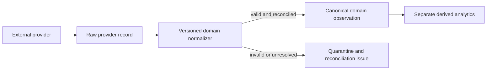

# Canonical external-data architecture

## Purpose and boundary

This document defines the shared path for provider-backed data. It does not replace
the controlled workbook migration tools or change a canonical financial or
investment domain. PostgreSQL remains canonical only for domains whose observations
have passed their migration and quality checks. Market data and reported
fundamentals and consensus estimates now have provider adapters using the contracts
below; FX and source documents remain scoped to their implemented domain paths or
future work.

The intended flow is:

Provider payloads are an ingestion boundary. Provider field names, codes, symbol
syntax, period labels and status enums must not become canonical application
schemas. A normalizer converts one provider's payload into the domain contract;
the canonical observation is keyed to application identity and follows that
domain's units, currency, temporal and quality rules.

## Shared provider contract

`apps/api/src/portfolio_api/external_data.py` defines the small shared interface:

- `ProviderQuery` carries a domain, canonical company/security/listing or currency
  pair subjects, an optional inclusive date window and a timezone-aware request
  time. Provider symbols are resolved inside the adapter from explicit mappings;
  ticker-only identity is never assumed.
- `ExternalDataProvider.fetch` returns raw records and is asynchronous so the
  eventual transport can perform network I/O without entering domain code.
- `RawProviderRecord` preserves the provider ID, provider-schema version, stable
  source record ID when available, source URL, media type, exact response bytes or
  a durable payload reference, SHA-256 and the time the application retrieved the
  response. Inline payload digests are checked at the boundary.
- `DomainNormalizer` is a deterministic, versioned adapter for one canonical
  domain. Its `NormalizationResult` returns that domain's typed observation or
  an explicit rejection with source-path issues. Accepted observations keep
  domain-specific quality fields; the shared interface does not invent a
  universal data-quality scale.
- `raw_record_fingerprint` makes an exact provider/domain/record/payload replay
  repeatable. `raw_batch_fingerprint` is independent of fetch order and retry time,
  but includes query scope and record content. If the provider returns changed
  bytes for an existing source record, the new content gets a different fingerprint
  and is treated as a correction candidate, not an update. Market-data batch receipts
  pair that raw digest with the normalizer version, so the same payload can be
  replayed once per normalizer version without replacing an earlier receipt or its
  canonical observations.

Provider credentials, network retries, rate limits and provider-specific pagination
belong inside adapters or the ingestion runner. They never enter canonical
observations or provenance. The canonical domain contract is authored and tested
independently of any provider SDK.

## Canonical domain ownership and time

Each source row retains its domain's meaningful effective or period time separately
from retrieval and database recording time. These fields answer different
questions:

| Data                   | Effective/period time                                    | Observed/published time                         | Recorded time           |
| ---------------------- | -------------------------------------------------------- | ----------------------------------------------- | ----------------------- |
| Listing price          | Market session/date                                      | Provider quote/as-of time, if supplied          | Application insert time |
| FX                     | Rate effective time                                      | Provider observation time                       | Application insert time |
| Corporate action       | Action effective date                                    | Provider announcement time, if supplied         | Application insert time |
| Reported fundamentals  | Fiscal period end and, where needed, instant/duration    | Filing/publication or provider observation time | Application insert time |
| Consensus estimate     | Forecast fiscal period plus estimate snapshot/as-of time | Provider publication/observation time           | Application insert time |
| Company/reference fact | Valid-from/valid-through interval where the fact changes | Source publication/observation time             | Application insert time |
| Filing/source document | Filed/published time                                     | Retrieval time                                  | Application insert time |

Do not reuse a single generic `effective_at` to mean market date, fiscal period,
estimate snapshot and document publication. Domain tables should carry the semantics
needed by that fact.

An honest historical query has two cutoffs: the domain's requested effective date
or fiscal period, and the latest time at which the application was allowed to know
the information (`recorded_at <= known_at`). It also applies an explicit
domain-specific source policy. A result as of a past date must not use a correction,
filing or estimate that was first observed later. If the provider has no source
history before the earliest retrieved observation, the API reports that coverage
gap; it must not synthesize earlier records from today's values.

## Source precedence and duplicate handling

Precedence is a versioned, domain-specific policy, not one global vendor ranking.
It may differ by listing/venue, currency, metric, financial-statement basis and
forecast period. A policy records its scope, source tiers, quality/fallback rules,
effective interval and version. Changing policy creates a new version; it does not
rewrite prior canonical observations or historical analytics.

The resolver follows these rules:

1. Reject or quarantine an identity, currency, unit, period or adjustment-basis
   mismatch. A preferred source cannot make an economically incomparable value
   usable.
2. Apply the explicit source tier for that domain and scope. Newer retrieval time
   is not evidence that one provider is more authoritative.
3. Apply that domain's quality policy. A verified fallback remains visibly a
   fallback; an unspecified or invalid value is never silently promoted to clean.
4. Within the chosen source tier, use effective/as-of recency only when selecting
   a current observation for a domain where that ordering is meaningful.
5. If two equally preferred sources materially disagree and no documented rule
   resolves them, retain both observations and emit a conflict/data-check state.
   Do not average, merge fields, or choose by arbitrary row order.

An exact repeat of provider, domain, source-record identity and payload is
idempotent. A source record ID plus a different payload hash is a new raw
observation. A changed value for the same provider business key is appended as a
correction/restatement and points to the prior canonical observation when the
domain supports supersession. Cross-provider values remain separate source
observations even when their business key and effective date coincide. Canonical
selection may point to one eligible observation under the policy; it does not
delete the alternatives.

Reported-fundamental restatements are especially important: retain each filing's
value and link a later same-source concept/period observation to its predecessor.
A changed later value is marked as a _potential_ restatement and `DATA_CHECK`; the
importer does not claim that the issuer formally restated a number unless the source
context establishes that. A query with an earlier `known_at` returns the value
observed and recorded by the application by that time; a later query can select the
newer filing under the domain's rules. A source that only exposes the latest value
cannot support a claim about what the application knew before retrieval began.

## Data quality and raw retention

The common pipeline distinguishes only whether normalization produced an acceptable
domain object or an explicit rejection. Canonical quality remains domain-owned,
for example the existing price states `PASS`, `PASS_VERIFIED_FALLBACK`,
`UNSPECIFIED` and `INVALID`. A rejected row keeps its raw evidence and an issue; it
does not become a zero, a valid empty observation or a passing status. A provider
response with no rows is reported as coverage/no-data for the requested scope; it
does not fabricate one missing observation per expected date.

Retain the exact raw payload when provider terms, licensing, size and security
policy allow and when it materially helps reprocessing or investigation. Store a
content hash, provider record ID, media type, retrieval time and source locator
with every retained payload. `payload_ref` must be a durable opaque object
reference, not a temporary authenticated URL; its content hash is verified before
the record is created. Large filings and other documents should use durable object
storage with relational metadata and checksums rather than large database columns.
When raw retention is prohibited or too costly, preserve the stable source
identifier/URL and payload hash and document that the response cannot be replayed.
Never persist credentials in a payload index.

## Existing implementation and scope decision

The current workbook flows already provide useful pieces, but they are migration
adapters rather than provider adapters:

- `market_data.py` requires an exact venue/ticker/currency listing crosswalk,
  checks provider symbols and quality, hashes each workbook snapshot, stores a
  reconciliation receipt, appends price/action/regime observations and tests the
  derived metrics against cached reference values.
- `legacy_import.py` uses source workbook hashes, stable IDs, precise cell
  references and separates the time the file was observed from a claimed source
  effective date.
- `model_outputs.py` uses content-addressed import batches and immutable normalized
  snapshots while retaining sheet/cell provenance. None of these importers evaluates
  workbook formulas or connects to Google Sheets at runtime.
- Existing `MarketDataBatch`, `LegacyImportBatch` and `ModelOutputImportBatch`
  records remain domain-specific migration receipts. Market prices, FX, corporate
  actions and outputs remain in their existing typed canonical tables.

The provider-neutral contracts in `external_data.py` have operational
implementations in `yahoo_finance.py`, `reported_fundamentals.py` and
`consensus_estimates.py`:
`YahooFinanceProvider` reads chart-v8
responses for exact reviewed listing and currency-pair subjects. The versioned
crosswalk records canonical identity, provider symbol, exchange, instrument type,
provider currency and any unit multiplier. The adapter checks returned identity
metadata before it accepts a response. The transport can be replaced without
changing the application-domain observations.

Market-data ingestion stores compressed raw chart responses in the shared
`external_raw_payloads` table, tied to provider/domain/query batch, raw source ID,
source URL, retrieval time and SHA-256. Price, FX and corporate-action observations
are still written to typed canonical tables; provider fields do not leak into a
generic fact table. The same source digest and provider business keys make a replay
idempotent. Changed source content becomes an appended correction linked to the
prior fact where that domain supports supersession.

`SecCompanyFactsProvider` reads SEC Company Facts only for an operator-verified
company-to-CIK crosswalk. Canonical facts use a reviewed allowlist of standard
US-GAAP and IFRS concepts; source taxonomy, concept, unit, accession and form stay
on each observation as provenance. The SEC CIK and provider entity name are checked
against the crosswalk before import. Ticker/name guessing and custom issuer
taxonomy inference are not used. Unknown standard concepts and unsupported
duration/period contexts appear in each batch's reconciliation counters. Current
selection gives SEC facts priority 10 and reserves priority 50 for normalized
complementary providers; those are versioned policy values, not provider fields.
Conflicting observations are retained and surfaced. A conflict between equally
preferred candidates withholds the selected value; disagreement with a lower
priority candidate keeps the preferred value but marks it `CONFLICT`.

The fundamentals importer stores SEC's raw Company Facts response in the shared
compressed payload table and creates immutable batch and fact rows. Replaying the
same payload under the same normalizer version is idempotent. Facts retain fiscal
period, filing date, retrieval time, database recording time, currency, source unit,
filing/accession and source URL. Duration facts that represent year-to-date periods
are not relabeled as discrete quarters. Cash/debt balance facts are period-end
instants; no total debt, free cash flow, growth or ratio is synthesized by this
layer. See [`reported-fundamentals.md`](reported-fundamentals.md) for its scope,
coverage and operator workflow.

`FmpConsensusProvider` adapts the stable annual/quarterly analyst-estimates response
to the shared raw-record boundary. `FmpConsensusNormalizer` maps only forward-period
revenue/EPS means, low/high ranges and provider analyst counts. Provider-symbol
identity and estimate currency require reviewed mapping evidence. Captured response
bytes are stored with their retrieval timestamp and hash. The provider's period-end
date is never used as an estimate-observation time. Since the current endpoint gives
the present estimates, historical revision history starts with the application's
first capture; it is not reconstructed from current values. See
[`consensus-estimates.md`](consensus-estimates.md).

The source-document catalog adds a narrow SEC EDGAR submissions adapter for exact
reviewed CIK mappings. It retains compressed submissions metadata and batch
reconciliation in the shared raw-payload architecture, then normalizes supported
filings into immutable `SourceDocument` records with accession, form, period and
filing dates, retrieval/recorded times, source URL, and amendment links. Filing
bodies and exhibits remain at SEC. Issuer annual reports and earnings releases can
be registered as HTTPS references; no company-site crawler or content downloader
is included. See [`source-documents.md`](source-documents.md) for provider limits,
operator steps and retention boundaries.

No provider registry, universal measurement table or general event-sourcing layer
was added. The workbook importers remain migration adapters. Yahoo chart v8 is a
practical current development source behind the adapter, not a provider-independent
domain decision or production service-level guarantee. The canonical data contract
and ingestion interface remain provider-neutral. A new source must be added as an
adapter plus a reviewed crosswalk and explicit domain precedence rule; it does not
replace Yahoo facts or workbook observations in place.

## Recommended ingestion order

1. Resolve canonical company/security/listing identity and provider crosswalks,
   including currencies and instrument basis. Keep unresolved matches in a review
   queue rather than matching by ticker or name alone.
2. Continue resolving reviewed company/CIK identities and ingest source-document
   metadata so subsequent facts and revisions can point to exact filing accessions.
   Review source-specific retention terms before storing document bodies.
3. Market prices, dated FX and listing-specific corporate actions now use a
   provider adapter for the verified active universe. Continue improving provider
   breadth and independently reconcile action coverage before widening source
   precedence or claiming licensed production coverage.
4. Add verified company/CIK identities, ingest reported fundamentals, and reconcile
   representative statements and filings before widening concept coverage.
5. Configure reviewed primary consensus mappings and capture provider estimates
   prospectively; do not reconstruct unavailable historical consensus.
6. Add derived analytics only after their canonical inputs, as-of policy and
   representative reconciliations are established. Store analytics separately
   with methodology version and references to the exact input observations used.

## Recurring operations

`portfolio_api.external_ingestion` runs the existing SEC, FMP and Yahoo adapters
as a daily one-shot worker. PostgreSQL records provider/domain run state, freshness,
partial results and bounded attempt failures separately from provider batch receipts
and canonical observations. Run `npm run db:ingest-external-data -- status` to
inspect operations, and see [external-data-operations.md](external-data-operations.md)
for cadence, retries, replay and deployment configuration. This worker does not
change source precedence, fill identity gaps, or make observations canonical when
normalization or domain quality checks reject them.

The sequence is a recommendation; it does not imply that unlisted providers or
domain observations are available.
